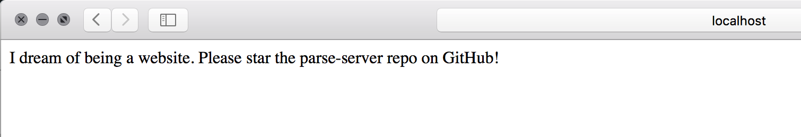

# Homebrew
```
$ brew update
```
# Setting up mLab MongoDB 
* Go to the [mLab](https://mlab.com/)  website and create an account
* Once you get a confirmation email, activate your account
* After you have activated the account, you can setup a new MongoDB deployment
* Choose AWS, US East-1 zone, Single-node and the Sandbox options to ensure that you get the free account
* Select your database name (I have named it recreo-app) and create your new MongoDB deployment
* Select the application you created and then under *Users > Add Users*, add a database user (ping me for credentials) with password
* Save your database URI for future reference
```
mongodb://<dbuser>:<dbpassword>@ds125481.mlab.com:25481/recreo-app
```

# Setting up local MongoDB
```
$ brew install mongodb
$ mkdir -p /data/db
$ sudo chown -R `id -un` /data/db
$ mongodb --config /usr/local/etc/mongod.conf
```
Verify the installation is successful, in a new terminal window
```
$ mongo
MongoDB shell version v3.4.4
connecting to: mongodb://127.0.0.1:27017
MongoDB server version: 3.4.4
Server has startup warnings:
2017-04-28T13:45:35.198-0700 I CONTROL  [initandlisten]
2017-04-28T13:45:35.198-0700 I CONTROL  [initandlisten] ** WARNING: Access control is not enabled for the database.
2017-04-28T13:45:35.198-0700 I CONTROL  [initandlisten] **          Read and write access to data and configuration is unrestricted.
2017-04-28T13:45:35.199-0700 I CONTROL  [initandlisten]
```
Quit by typing in Ctrl+C

# Python
Verify if you have python installed
```
$ python --version
Python 3.5.2 :: Anaconda custom (x86_64)
```
If not install python using brew or anaconda

# Node
Install or upgrade to the latest version of Node
```
$ brew install node OR brew upgrade node
```
Verify the version installed
```
$ node --version
v7.9.0
```
# Installing the Parse version
```
$ git clone https://github.com/ParsePlatform/parse-server-example.git Parse
$ cd Parse
$ npm install
```
Start the Parse Server
```
$ npm run start
```
Check if the server started successfully by going to http://localhost:1337

You can stop the server by doing a Ctrl+C

Lets now setup the local parse server to talk to the remote mLab mongo database
From the root folder of the Parse project, edit index.js and replace the databaseUri variable to match the database URI from mLab
```
Replace
var databaseUri = process.env.DATABASE_URI || process.env.MONGOLAB_URI;

with
var databaseUri = 'mongodb://<dbuser>:<dbpassword>@ds125481.mlab.com:25481/recreo-app';
```
Next replace the default application id with our app's bundle identifier
```
Replace
appId: process.env.APP_ID || 'myAppId',

with
appId: process.env.APP_ID || 'com.intuit.Recreo', 
```
Once this is setup up, test the parse server connection to the remote database. Start the server again from the Parse repository root
```
$ npm run start
```
Lets post something random to our mongodb
```
$ curl -X POST -H 'X-Parse-Application-Id: com.intuit.Recreo'   -H 'Content-Type: application/json'   -d '{}' http://localhost:1337/parse/classes/WallPost
{"objectId":"1PJ9kmJDwD","createdAt":"2017-04-28T23:02:15.603Z"}
```
Parse server should now be functioning

# Deploying Parse Server to Heroku
Install Heroku tool belt using brew
```
$ brew install heroku
```
Create a heroku account from the sign up page and then authenticate with your heroku username and password
```
$ heroku login
```
From the Parse directory, create an application on Heroku and push your source code to the Heroku server
```
$ heroku create
```
A heroku service is created and deployed for you, mine was https://glacial-ridge-90974.herokuapp.com/
Next, lets commit the changes to the index.js file we made and push the Parse server to the remote Heroku service
```
$ git add .
$ git commit -m "commit message"
$ git push heroku master
```
Navigate to https://glacial-ridge-90974.herokuapp.com/ and you should see the same message "I dream of being a website" as you saw when you connected to the server locally. You can also run the same curl command against the Heroku service to check
```
$ curl -X POST -H 'X-Parse-Applicn'   -d '{}' https://glacial-ridge-90974.herokuapp.com/parse/classes/WallPost
{"objectId":"Jb4uQgB30D","createdAt":"2017-04-28T23:10:18.491Z"}
```
At this point we have setup the Parse server and the backing mongoDB on the cloud.

# Setting up the Parse Dashboard
Install the parse-dashboard project locally
```
$ git clone https://github.com/ParsePlatform/parse-dashboard.git
$ cd parse-dashboard
$ npm install
```
Navigate to the Parse-Dashboard subfolder and edit the parse-dashboard-config.json file
```{json}
{
  "apps": [
   {
    "serverURL": "https://glacial-ridge-90974.herokuapp.com/parse",
    "appId": "com.intuit.Recreo",
    "masterKey": "recreo_test",
    "appName": "Heroku Recreo App"
   }
  ],
  "users": [
     {
        "user": "test",
        "pass": "test"
     }
  ]
}
```
Next modify the .gitignore file in the parse-dashboard repo to remove the following entries
```
bundles/
Parse-Dashboard/public/bundles/
Parse-Dashboard/parse-dashboard-config.json
```
Stage and commit these changes
```
$ git add -A
$ git commit -m "preparing dashboard for deployment"
```
Create a new app from the Heroku dashboard. From the parse-dashboard directory, run the following commands
```
$ git init .
$ heroku git:remote -a <heroku_appname>
$ git push heroku master
```
After this there is one more step you need to do is to turn off SSL requirement
Navigate to the Settings tab for the dashboard app, and add a config variable
*PARSE_DASHBOARD_ALLOW_INSECURE_HTTP* and give it a value 1
Your [Parse dashboard](https://recreo-parsedashboard.herokuapp.com/apps) is now ready 

# References
* https://www.raywenderlich.com/146736/parse-server-tutorial-ios
* https://www.codementor.io/mattgoldspink/deploy-parse-dashboard-on-heroku-du1083egs
* https://www.andrewcbancroft.com/2016/04/17/deploying-parse-dashboard/


